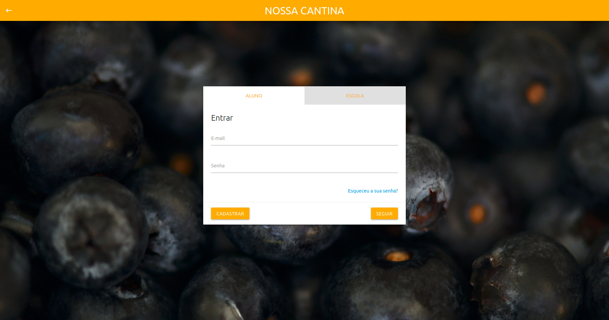
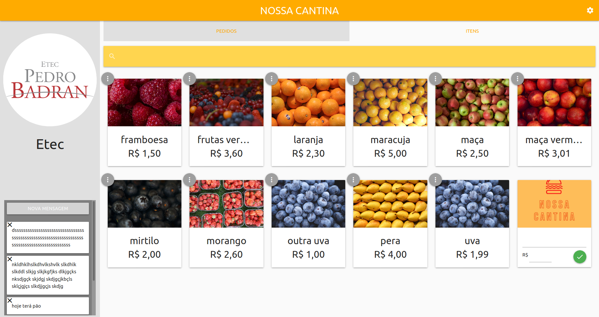
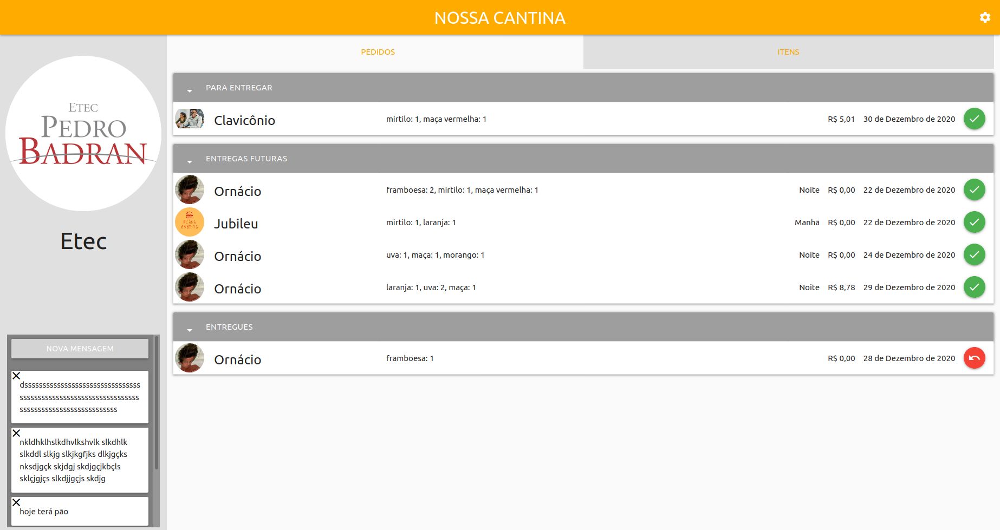
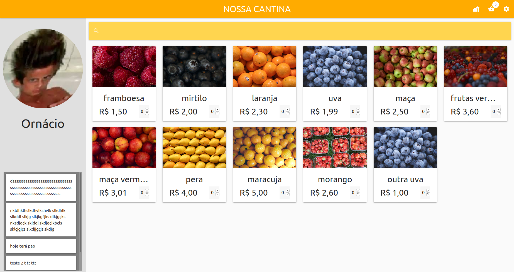

# Nossa Cantina
O objetivo deste projeto é facilitar e agilizar a compra de produtos nas cantinas escolares para diminuir o tempo gasto em filas.  
Feito utilizando Django para o Back-end e Materialize css para o Front-end.

## Como executar
Execute
```bash
docker compose up
# ou, caso você use podman
podman-compose up
```
E acesse [0.0.0.0:8000](0.0.0.0:8000).  

## Como usar
* Crie uma conta de escola;
* Cadastre itens para a escola;
* Crie uma conta de aluno, introduzindo o nome da escola criada no campo escola;
* Veja e selecione os itens da escola.

## Capturas
<br>
<br>
<br>
<br>
